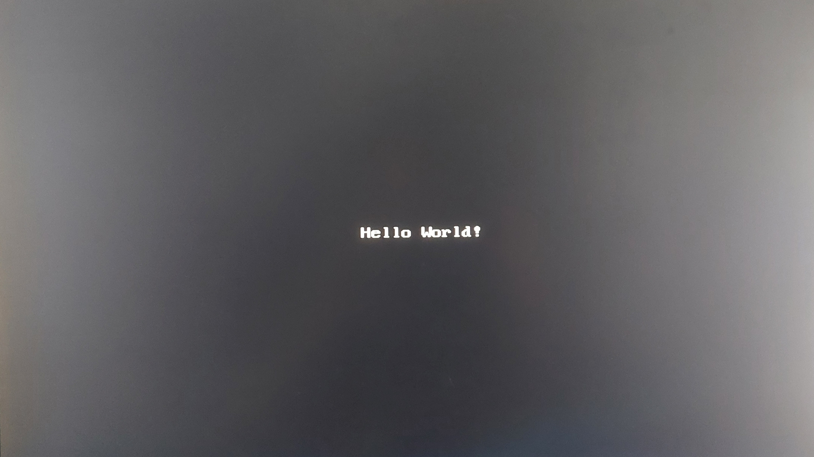

# VGA Display

A test design on the DE10-Lite fpga of vga capabilities including a full RGB test as well as memory-stored 8x16 ASCII values mapped to a 80x30 screen on a 640x480 display.

---

## Repository Structure
The repository is organized as follows:

- `Documentation/`: Holds images and visual assets related to the project.
- `RGBTest/`: Contains RGB test project files and verilog for RTL.
- `ROMWhiteText/`: Contains white text project and verilog for RTL.

---

## RGB Screen

 

---

## White Text Screen

 

---

## License
This is published under the [MIT License](https://opensource.org/licenses/MIT).

